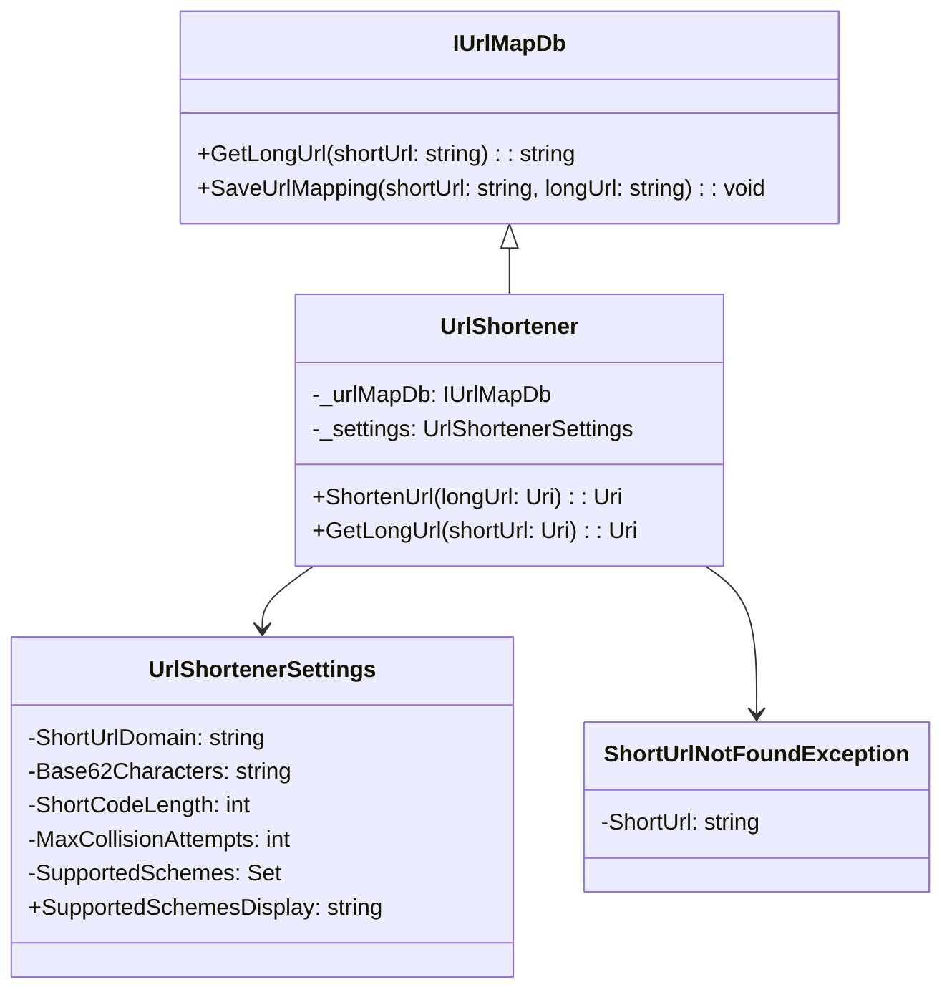

```mermaid
classDiagram
    class IUrlMapDb {
        +GetLongUrl(shortUrl: string): string
        +SaveUrlMapping(shortUrl: string, longUrl: string): void
    }

    class UrlShortenerSettings {
        -ShortUrlDomain: string
        -Base62Characters: string
        -ShortCodeLength: int
        -MaxCollisionAttempts: int
        -SupportedSchemes: Set<string>
        +SupportedSchemesDisplay: string
    }

    class ShortUrlNotFoundException {
        -ShortUrl: string
    }

    class UrlShortener {
        -_urlMapDb: IUrlMapDb
        -_settings: UrlShortenerSettings
        +ShortenUrl(longUrl: Uri): Uri
        +GetLongUrl(shortUrl: Uri): Uri
    }

    IUrlMapDb <|-- UrlShortener
    UrlShortener --> UrlShortenerSettings
    UrlShortener --> ShortUrlNotFoundException
```
