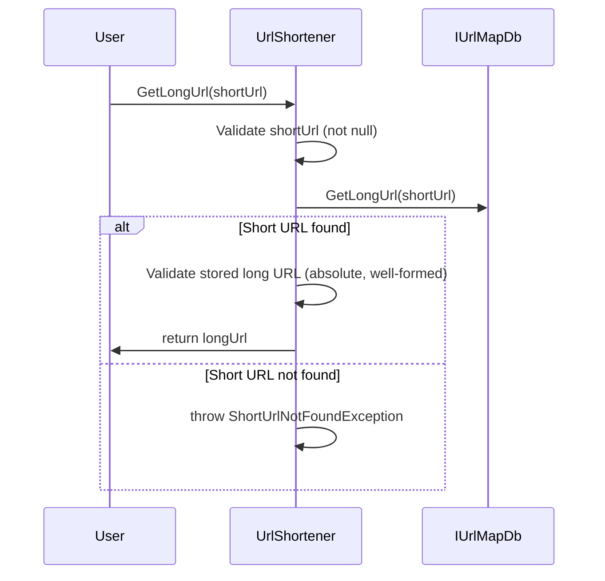

```mermaid
sequenceDiagram
    participant User
    participant UrlShortener
    participant Db as IUrlMapDb

    User->>UrlShortener: GetLongUrl(shortUrl)
    UrlShortener->>UrlShortener: Validate shortUrl (not null)
    UrlShortener->>Db: GetLongUrl(shortUrl)

    alt Short URL found
        UrlShortener->>UrlShortener: Validate stored long URL (absolute, well-formed)
        UrlShortener->>User: return longUrl
    else Short URL not found
        UrlShortener->>UrlShortener: throw ShortUrlNotFoundException
    end
```