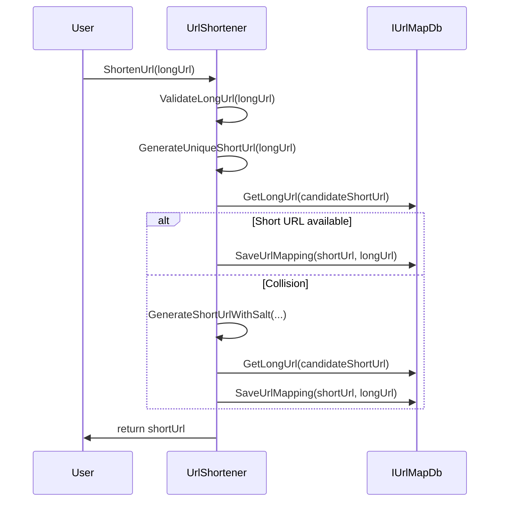

```mermaid
sequenceDiagram
    participant User
    participant UrlShortener
    participant Db as IUrlMapDb

    User->>UrlShortener: ShortenUrl(longUrl)
    UrlShortener->>UrlShortener: ValidateLongUrl(longUrl)
    UrlShortener->>UrlShortener: GenerateUniqueShortUrl(longUrl)
    UrlShortener->>Db: GetLongUrl(candidateShortUrl)
    alt Short URL available
        UrlShortener->>Db: SaveUrlMapping(shortUrl, longUrl)
    else Collision
        UrlShortener->>UrlShortener: GenerateShortUrlWithSalt(...)
        UrlShortener->>Db: GetLongUrl(candidateShortUrl)
        UrlShortener->>Db: SaveUrlMapping(shortUrl, longUrl)
    end
    UrlShortener->>User: return shortUrl
```
